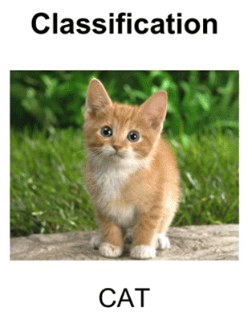

# Object Classification using OpenCV and CVZone

This repository contains code for real-time object classification using OpenCV and CVZone. It uses a pre-trained Keras model for classification and displays FPS (Frames Per Second) on the captured video stream.

## Overview

Object classification involves identifying objects in images or video frames using a trained model. This project utilizes OpenCV for capturing video from a webcam and CVZone for real-time classification and FPS calculation.


## Dependencies

- Python 3.6+
- OpenCV
- CVZone
- Keras

## Installation

To run this project, follow these steps:

1. Clone the repository:

   ```bash
   git clone https://github.com/SlimenFellah/Object-Classification.git
   cd Object-Classification
   ```
Install dependencies:

  ```
  pip install -r requirements.txt
  ```
Usage
Ensure your webcam is connected and accessible.

Run the main.py script:
  ```
  python main.py
  ```
The script will open a window showing the webcam feed with real-time object classification predictions and FPS displayed.

Customization
Model: Replace ./myModel/keras_model.h5 with your own trained Keras model path.
Labels: Update ./myModel/labels.txt with your labels file corresponding to the model.
Settings: Modify the code to adjust settings such as FPS display position or scale.

### Instructions:

- **Dependencies**: Update the `requirements.txt` file with the actual dependencies used in your project.
- **Customization**: Add any additional customization or configuration instructions specific to your project, such as model paths, label files, or settings adjustments.
- **License**: Ensure the `LICENSE` file in your repository reflects the appropriate license for your project.


